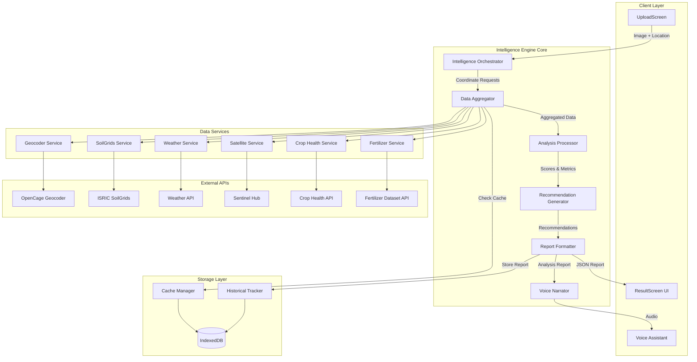
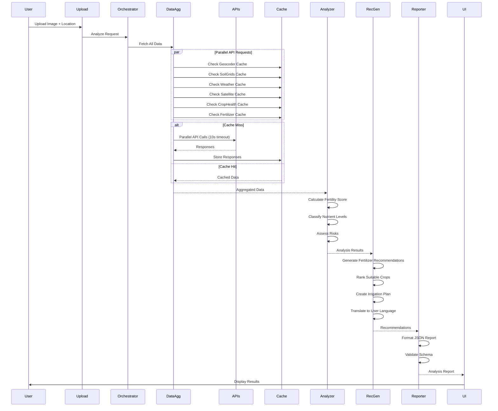

# Design Document: Agricultural Intelligence Engine

## Overview

The Agricultural Intelligence Engine transforms the Farmer Soil Analyzer PWA from a basic soil classification tool into a comprehensive agricultural decision support system. The engine integrates six external data sources (geocoding, soil properties, weather, satellite imagery, crop health, and fertilizer datasets) with the existing ML-based soil recognition model to generate actionable, multi-language farming recommendations.

### System Goals

- Aggregate multi-source environmental data within 15 seconds
- Generate comprehensive agricultural recommendations with 95%+ data completeness
- Support offline operation with cached data (up to 7 days freshness)
- Deliver recommendations in 13 Indian languages with voice narration
- Maintain historical analysis tracking for trend identification
- Ensure graceful degradation when APIs are unavailable

### Key Design Principles

1. **Resilience First**: System must function with partial data availability
2. **Performance Optimization**: Parallel API requests, aggressive caching, lazy loading
3. **Data Integrity**: Validation at every boundary, round-trip verification
4. **User-Centric**: Simple UI, voice support, offline capability
5. **Transparency**: Expose calculation methodology and data sources

## Architecture

### High-Level Component Architecture



### Data Flow Pipeline



### Component Responsibilities

#### Intelligence Orchestrator
- Entry point for analysis requests
- Coordinates data aggregation, analysis, and reporting phases
- Manages error handling and fallback strategies
- Enforces 15-second total processing time limit

#### Data Aggregator
- Executes parallel API requests with 10-second timeout per request
- Implements retry logic with exponential backoff
- Validates API responses against schemas
- Coordinates with Cache Manager for data retrieval/storage
- Returns partial data when some APIs fail

#### Analysis Processor
- Calculates Fertility Score (nitrogen 40%, organic carbon 35%, pH 25%)
- Classifies nutrient levels (deficient/moderate/sufficient)
- Assesses environmental risks (drought, nutrient deficiency, crop stress)
- Validates data consistency between sources
- Completes all calculations within 2 seconds

#### Recommendation Generator
- Generates fertilizer recommendations with dosages
- Ranks suitable crops by priority score
- Creates irrigation plans based on soil moisture and weather
- Translates recommendations to user's selected language
- Provides application schedules considering weather forecasts

#### Report Formatter
- Structures data into standardized JSON schema
- Validates report completeness and correctness
- Includes metadata (data sources, timestamps, confidence levels)
- Serializes report within 500ms
- Implements round-trip validation

#### Voice Narrator
- Converts farmer_advice text to speech using Sarvam AI
- Generates separate audio segments for key recommendations
- Handles language-specific voice models
- Queues failed synthesis for retry

#### Cache Manager
- Stores API responses in IndexedDB with timestamps
- Implements cache expiration policies (24h weather, 7d soil, 3d satellite)
- Returns cached data with freshness indicators
- Manages cache size limits

#### Historical Tracker
- Stores complete Analysis Reports in IndexedDB
- Maintains maximum 50 reports per user (FIFO eviction)
- Provides location-based retrieval (1km radius)
- Supports trend analysis queries

## Components and Interfaces

### API Service Classes

#### GeocoderService

```javascript
class GeocoderService {
  constructor(apiKey) {
    this.apiKey = apiKey;
    this.baseUrl = 'https://api.opencagedata.com/geocode/v1';
    this.timeout = 10000;
  }

  /**
   * Reverse geocode coordinates to location details
   * @param {number} latitude - Latitude coordinate
   * @param {number} longitude - Longitude coordinate
   * @returns {Promise<LocationData>} Location information
   */
  async reverseGeocode(latitude, longitude) {
    // Implementation with timeout, retry, validation
  }
}

// Response Schema
interface LocationData {
  latitude: number;
  longitude: number;
  district: string;
  state: string;
  country: string;
  formatted_address: string;
}
```

#### SoilGridsService

```javascript
class SoilGridsService {
  constructor() {
    this.baseUrl = 'https://rest.isric.org/soilgrids/v2.0';
    this.timeout = 10000;
  }

  /**
   * Fetch soil properties for location
   * @param {number} latitude - Latitude coordinate
   * @param {number} longitude - Longitude coordinate
   * @param {number} depth - Soil depth in cm (default: 0-5cm)
   * @returns {Promise<SoilProperties>} Soil property data
   */
  async getSoilProperties(latitude, longitude, depth = 5) {
    // Implementation with validation
  }
}

// Response Schema
interface SoilProperties {
  soil_ph: number;              // pH value (3.0-10.0)
  nitrogen_content: number;     // Percentage (0-1.0)
  organic_carbon: number;       // Percentage (0-10.0)
  soil_clay_percentage: number; // Percentage (0-100)
  soil_sand_percentage: number; // Percentage (0-100)
  cec: number;                  // Cation exchange capacity
}
```

#### WeatherService

```javascript
class WeatherService {
  constructor(apiKey) {
    this.apiKey = apiKey;
    this.baseUrl = 'https://api.weatherapi.com/v1';
    this.timeout = 10000;
  }

  /**
   * Fetch current weather and 7-day forecast
   * @param {number} latitude - Latitude coordinate
   * @param {number} longitude - Longitude coordinate
   * @returns {Promise<WeatherData>} Weather information
   */
  async getWeatherData(latitude, longitude) {
    // Implementation with forecast parsing
  }
}

// Response Schema
interface WeatherData {
  temperature: number;           // Celsius
  rainfall_30d: number;          // mm in last 30 days
  humidity: number;              // Percentage
  weather_forecast_7_days: Array<{
    date: string;
    temp_max: number;
    temp_min: number;
    rainfall_mm: number;
    humidity: number;
  }>;
}
```

#### SatelliteService

```javascript
class SatelliteService {
  constructor(clientId, clientSecret) {
    this.clientId = clientId;
    this.clientSecret = clientSecret;
    this.baseUrl = 'https://services.sentinel-hub.com';
    this.timeout = 15000; // Longer timeout for imagery
  }

  /**
   * Fetch satellite imagery metrics
   * @param {number} latitude - Latitude coordinate
   * @param {number} longitude - Longitude coordinate
   * @param {string} date - Date for imagery (YYYY-MM-DD)
   * @returns {Promise<SatelliteMetrics>} Satellite-derived metrics
   */
  async getSatelliteMetrics(latitude, longitude, date) {
    // Implementation with OAuth2 authentication
  }
}

// Response Schema
interface SatelliteMetrics {
  ndvi: number;                  // -1.0 to 1.0
  vegetation_stress_index: number; // 0.0 to 1.0
  soil_moisture_index: number;   // 0.0 to 1.0
  acquisition_date: string;
  cloud_coverage: number;        // Percentage
}
```

#### CropHealthService

```javascript
class CropHealthService {
  constructor(apiKey) {
    this.apiKey = apiKey;
    this.baseUrl = 'https://api.crophealth.io/v1';
    this.timeout = 10000;
  }

  /**
   * Fetch crop health indicators
   * @param {number} latitude - Latitude coordinate
   * @param {number} longitude - Longitude coordinate
   * @param {number} ndvi - NDVI value from satellite
   * @returns {Promise<CropHealthData>} Crop health indicators
   */
  async getCropHealth(latitude, longitude, ndvi) {
    // Implementation with NDVI-based analysis
  }
}

// Response Schema
interface CropHealthData {
  crop_stress_indicators: Array<string>; // e.g., ["water_stress", "nutrient_deficiency"]
  vegetation_growth_stage: string;       // e.g., "vegetative", "flowering", "maturity"
  health_score: number;                  // 0-100
}
```

#### FertilizerService

```javascript
class FertilizerService {
  constructor() {
    this.baseUrl = 'https://api.fertilizer-dataset.org/v1';
    this.timeout = 10000;
  }

  /**
   * Fetch fertilizer recommendations
   * @param {string} soilType - Soil classification
   * @param {Object} nutrientLevels - Current NPK levels
   * @param {string} cropType - Target crop (optional)
   * @returns {Promise<FertilizerRecommendation>} Fertilizer advice
   */
  async getFertilizerRecommendation(soilType, nutrientLevels, cropType = null) {
    // Implementation with crop-specific recommendations
  }
}

// Response Schema
interface FertilizerRecommendation {
  npk_ratio: string;             // e.g., "20:20:20"
  nitrogen_kg_per_acre: number;
  phosphorus_kg_per_acre: number;
  potassium_kg_per_acre: number;
  organic_amendments: Array<string>;
  application_method: string;
}
```

### Core Processing Interfaces

#### Analysis Processor Interface

```javascript
class AnalysisProcessor {
  /**
   * Calculate soil fertility score
   * @param {SoilProperties} soilProps - Soil property data
   * @returns {FertilityAnalysis} Fertility score and breakdown
   */
  calculateFertilityScore(soilProps) {
    // Weighted calculation: N(40%) + OC(35%) + pH(25%)
  }

  /**
   * Classify nutrient levels
   * @param {SoilProperties} soilProps - Soil property data
   * @param {string} cropType - Target crop for thresholds
   * @returns {NutrientStatus} Classification for N, P, K
   */
  classifyNutrientLevels(soilProps, cropType = null) {
    // Threshold-based classification
  }

  /**
   * Assess environmental risks
   * @param {WeatherData} weather - Weather information
   * @param {SatelliteMetrics} satellite - Satellite metrics
   * @param {NutrientStatus} nutrients - Nutrient status
   * @returns {RiskAssessment} Risk levels and probabilities
   */
  assessRisks(weather, satellite, nutrients) {
    // Multi-factor risk calculation
  }
}

// Output Schemas
interface FertilityAnalysis {
  fertility_score: number;       // 0-100
  calculation_details: {
    nitrogen_contribution: number;
    organic_carbon_contribution: number;
    ph_contribution: number;
  };
  classification: string;        // "poor", "moderate", "good", "excellent"
}

interface NutrientStatus {
  nitrogen_level: string;        // "deficient", "moderate", "sufficient"
  phosphorus_level: string;
  potassium_level: string;
  deficiencies: Array<string>;
}

interface RiskAssessment {
  drought_risk: string;          // "low", "medium", "high"
  nutrient_deficiency_risk: string;
  crop_stress_probability: number; // 0-100
  pest_disease_risk: string;
  risk_factors: Array<string>;
}
```

#### Recommendation Generator Interface

```javascript
class RecommendationGenerator {
  /**
   * Generate fertilizer recommendations
   * @param {NutrientStatus} nutrients - Nutrient deficiencies
   * @param {SoilProperties} soil - Soil properties
   * @param {WeatherData} weather - Weather forecast
   * @param {FertilizerRecommendation} fertData - Fertilizer dataset
   * @returns {FertilizerAdvice} Detailed fertilizer recommendations
   */
  generateFertilizerRecommendation(nutrients, soil, weather, fertData) {
    // Dosage calculation with weather-based scheduling
  }

  /**
   * Rank suitable crops
   * @param {SoilProperties} soil - Soil properties
   * @param {WeatherData} weather - Weather data
   * @param {SatelliteMetrics} satellite - Satellite metrics
   * @param {LocationData} location - Geographic location
   * @returns {Array<CropRecommendation>} Ranked crop list (max 5)
   */
  rankSuitableCrops(soil, weather, satellite, location) {
    // Priority scoring algorithm
  }

  /**
   * Create irrigation plan
   * @param {SatelliteMetrics} satellite - Soil moisture data
   * @param {WeatherData} weather - Weather forecast
   * @param {string} soilTexture - Soil texture classification
   * @param {string} cropType - Current/planned crop
   * @returns {IrrigationPlan} Irrigation recommendations
   */
  createIrrigationPlan(satellite, weather, soilTexture, cropType) {
    // Moisture-based irrigation scheduling
  }

  /**
   * Translate recommendations to target language
   * @param {Object} recommendations - All recommendations
   * @param {string} languageCode - Target language (ISO 639-1)
   * @returns {Promise<Object>} Translated recommendations
   */
  async translateRecommendations(recommendations, languageCode) {
    // Translation with agricultural terminology preservation
  }
}

// Output Schemas
interface FertilizerAdvice {
  fertilizer_type: string;
  npk_ratio: string;
  dosage_per_acre: number;
  application_schedule: Array<{
    timing: string;
    amount_kg: number;
    method: string;
    weather_conditions: string;
  }>;
  organic_alternatives: Array<string>;
  cost_estimate: number;
}

interface CropRecommendation {
  crop_name: string;
  crop_priority_score: number;   // 0-100
  scoring_factors: {
    soil_suitability: number;
    climate_match: number;
    water_requirement_match: number;
    market_potential: number;
  };
  expected_yield: string;
  growing_season: string;
  water_requirement: string;
}

interface IrrigationPlan {
  immediate_action: string;      // "irrigate_now", "delay", "monitor"
  volume_liters_per_sqm: number;
  frequency_days: number;
  schedule: Array<{
    date: string;
    action: string;
    volume: number;
  }>;
  water_conservation_tips: Array<string>;
}
```

## Data Models

### Analysis Report Schema

The complete JSON structure returned to the client:

```json
{
  "report_id": "uuid-v4",
  "report_timestamp": "2024-01-15T10:30:00Z",
  "language_code": "hi",
  "offline_mode": false,
  
  "location": {
    "latitude": 12.9716,
    "longitude": 77.5946,
    "district": "Bangalore Urban",
    "state": "Karnataka",
    "country": "India",
    "formatted_address": "Bangalore, Karnataka, India"
  },
  
  "soil_analysis": {
    "soil_type": "Loamy",
    "soil_texture": "Medium",
    "soil_color": "Brown",
    "predicted_soil_class": "Alfisol",
    "fertility_score": 72,
    "fertility_classification": "good",
    "calculation_details": {
      "nitrogen_contribution": 28.8,
      "organic_carbon_contribution": 25.2,
      "ph_contribution": 18.0
    },
    "soil_properties": {
      "soil_ph": 6.8,
      "nitrogen_content": 0.18,
      "organic_carbon": 1.8,
      "soil_clay_percentage": 32,
      "soil_sand_percentage": 42,
      "cec": 15.2
    }
  },
  
  "nutrient_status": {
    "nitrogen_level": "moderate",
    "phosphorus_level": "sufficient",
    "potassium_level": "deficient",
    "deficiencies": ["potassium"],
    "nutrient_details": {
      "nitrogen": {
        "value": 0.18,
        "unit": "percentage",
        "threshold_deficient": 0.15,
        "threshold_sufficient": 0.25
      },
      "phosphorus": {
        "value": 18.5,
        "unit": "ppm",
        "threshold_deficient": 10,
        "threshold_sufficient": 15
      },
      "potassium": {
        "value": 95,
        "unit": "ppm",
        "threshold_deficient": 120,
        "threshold_sufficient": 180
      }
    }
  },
  
  "fertilizer_recommendation": {
    "fertilizer_type": "NPK Complex + Potash Supplement",
    "npk_ratio": "12:32:16",
    "dosage_per_acre": 45,
    "application_schedule": [
      {
        "timing": "Immediate (within 3 days)",
        "amount_kg": 25,
        "method": "Broadcast and incorporate",
        "weather_conditions": "Apply before forecasted rain on Jan 18"
      },
      {
        "timing": "30 days after first application",
        "amount_kg": 20,
        "method": "Side dressing",
        "weather_conditions": "Avoid application if heavy rain expected"
      }
    ],
    "organic_alternatives": [
      "Vermicompost 2 tons/acre",
      "Wood ash 100 kg/acre for potassium"
    ],
    "cost_estimate": 1200
  },
  
  "crop_recommendation": {
    "suitable_crops": [
      {
        "crop_name": "Rice",
        "crop_priority_score": 88,
        "scoring_factors": {
          "soil_suitability": 90,
          "climate_match": 85,
          "water_requirement_match": 92,
          "market_potential": 85
        },
        "expected_yield": "4-5 tons/acre",
        "growing_season": "Kharif (June-November)",
        "water_requirement": "High (1200-1500mm)"
      },
      {
        "crop_name": "Vegetables (Tomato, Brinjal)",
        "crop_priority_score": 82,
        "scoring_factors": {
          "soil_suitability": 85,
          "climate_match": 80,
          "water_requirement_match": 78,
          "market_potential": 90
        },
        "expected_yield": "8-12 tons/acre",
        "growing_season": "Year-round with irrigation",
        "water_requirement": "Medium (600-800mm)"
      }
    ],
    "soil_improvement_needed": false
  },
  
  "environment_analysis": {
    "weather": {
      "temperature": 28,
      "rainfall_30d": 45,
      "humidity": 65,
      "forecast_summary": "Light rain expected in 3 days"
    },
    "satellite_metrics": {
      "ndvi": 0.62,
      "vegetation_stress_index": 0.35,
      "soil_moisture_index": 0.48,
      "acquisition_date": "2024-01-12",
      "cloud_coverage": 15
    },
    "crop_health": {
      "crop_stress_indicators": ["mild_water_stress"],
      "vegetation_growth_stage": "vegetative",
      "health_score": 75
    }
  },
  
  "risk_assessment": {
    "drought_risk": "medium",
    "nutrient_deficiency_risk": "medium",
    "crop_stress_probability": 45,
    "pest_disease_risk": "low",
    "risk_factors": [
      "Low rainfall in past 30 days",
      "Potassium deficiency detected",
      "Soil moisture below optimal"
    ]
  },
  
  "irrigation_plan": {
    "immediate_action": "monitor",
    "volume_liters_per_sqm": 25,
    "frequency_days": 5,
    "schedule": [
      {
        "date": "2024-01-20",
        "action": "irrigate",
        "volume": 25
      },
      {
        "date": "2024-01-25",
        "action": "irrigate",
        "volume": 25
      }
    ],
    "water_conservation_tips": [
      "Use drip irrigation to reduce water usage by 40%",
      "Mulch around plants to retain soil moisture"
    ]
  },
  
  "farmer_advice": {
    "summary": "आपकी मिट्टी अच्छी स्थिति में है लेकिन पोटैशियम की कमी है। तुरंत NPK उर्वरक डालें और 3 दिनों में होने वाली बारिश से पहले इसे मिट्टी में मिला दें।",
    "priority_actions": [
      "पोटैशियम युक्त उर्वरक 45 किलो प्रति एकड़ डालें",
      "बारिश के बाद सिंचाई की निगरानी करें",
      "धान या सब्जियों की खेती के लिए उपयुक्त"
    ],
    "detailed_advice": "आपकी मिट्टी की उर्वरता स्कोर 72/100 है जो अच्छा है। मिट्टी का pH 6.8 है जो फसलों के लिए आदर्श है। नाइट्रोजन और कार्बनिक पदार्थ मध्यम स्तर पर हैं, लेकिन पोटैशियम की कमी है जिसे तुरंत ठीक करना जरूरी है। अगले 3 दिनों में बारिश की संभावना है, इसलिए उर्वरक डालने का यह सही समय है। धान की खेती के लिए यह मिट्टी बहुत उपयुक्त है और 4-5 टन प्रति एकड़ उपज की उम्मीद है।"
  },
  
  "metadata": {
    "data_sources_used": [
      "soil_recognition_model",
      "opencage_geocoder",
      "isric_soilgrids",
      "weather_api",
      "sentinel_hub",
      "crop_health_api",
      "fertilizer_dataset"
    ],
    "data_freshness": {
      "geocoder": "live",
      "soilgrids": "cached_2d",
      "weather": "live",
      "satellite": "cached_1d",
      "crop_health": "live",
      "fertilizer": "live"
    },
    "confidence_level": 0.92,
    "processing_time_ms": 12450,
    "methodology_notes": "Fertility score calculated using weighted average: nitrogen (40%), organic carbon (35%), pH deviation (25%). Crop suitability based on multi-factor scoring including soil properties, climate data, and water availability."
  },
  
  "errors": [],
  "warnings": [
    "Satellite imagery has 15% cloud coverage - metrics may be less accurate"
  ]
}
```

### IndexedDB Schema

#### Cache Store Schema

```javascript
// Store: 'apiCache'
{
  id: "geocoder_12.9716_77.5946",  // Composite key: service_lat_lon
  service: "geocoder",              // Service identifier
  request_params: {                 // Original request parameters
    latitude: 12.9716,
    longitude: 77.5946
  },
  response_data: { /* API response */ },
  timestamp: 1705315800000,         // Unix timestamp
  expiry: 1705920600000,            // Expiration timestamp
  cache_duration_hours: 168         // 7 days for soil data
}

// Indexes:
// - service (for clearing specific service cache)
// - expiry (for cleanup of expired entries)
```

#### Historical Analysis Store Schema

```javascript
// Store: 'analysisHistory'
{
  id: 1,                            // Auto-increment primary key
  report_id: "uuid-v4",             // Unique report identifier
  timestamp: 1705315800000,         // Analysis timestamp
  location: {
    latitude: 12.9716,
    longitude: 77.5946,
    district: "Bangalore Urban",
    state: "Karnataka"
  },
  soil_type: "Loamy",
  fertility_score: 72,
  language: "hi",
  complete_report: { /* Full Analysis Report */ }
}

// Indexes:
// - timestamp (for chronological queries)
// - soil_type (for filtering by soil type)
// - language (for language-specific queries)
// - location_lat_lon (composite index for spatial queries)
```

### Cache Expiration Policies

| Data Source | Cache Duration | Rationale |
|-------------|----------------|-----------|
| Geocoder | 30 days | Location data rarely changes |
| SoilGrids | 7 days | Soil properties are relatively stable |
| Weather | 24 hours | Weather changes daily |
| Satellite | 3 days | Satellite passes every 2-5 days |
| Crop Health | 3 days | Vegetation changes gradually |
| Fertilizer Dataset | 30 days | Recommendation algorithms stable |


## Processing Algorithms

### Fertility Score Calculation

The fertility score is a weighted composite metric (0-100) that quantifies soil nutrient quality:

```
Fertility_Score = (N_score × 0.40) + (OC_score × 0.35) + (pH_score × 0.25)

Where:
  N_score = normalize(nitrogen_content, 0, 0.5) × 100
  OC_score = normalize(organic_carbon, 0, 5.0) × 100
  pH_score = pH_deviation_score(soil_ph)
```

**pH Deviation Score Algorithm:**

```javascript
function calculatePHScore(pH) {
  const optimal_min = 6.0;
  const optimal_max = 7.5;
  const acceptable_min = 5.0;
  const acceptable_max = 8.5;
  
  if (pH >= optimal_min && pH <= optimal_max) {
    return 100; // Perfect pH range
  }
  
  if (pH < optimal_min) {
    if (pH < acceptable_min) return 0; // Too acidic
    // Linear interpolation between acceptable_min and optimal_min
    return ((pH - acceptable_min) / (optimal_min - acceptable_min)) * 100;
  }
  
  if (pH > optimal_max) {
    if (pH > acceptable_max) return 0; // Too alkaline
    // Linear interpolation between optimal_max and acceptable_max
    return ((acceptable_max - pH) / (acceptable_max - optimal_max)) * 100;
  }
}
```

**Fertility Classification:**

```javascript
function classifyFertility(score) {
  if (score >= 80) return "excellent";
  if (score >= 65) return "good";
  if (score >= 45) return "moderate";
  return "poor";
}
```

### Nutrient Deficiency Classification

Nutrient levels are classified using threshold-based rules:

**Nitrogen Classification:**

```javascript
function classifyNitrogen(nitrogen_percentage) {
  if (nitrogen_percentage < 0.15) return "deficient";
  if (nitrogen_percentage < 0.25) return "moderate";
  return "sufficient";
}
```

**Phosphorus Classification (crop-specific):**

```javascript
function classifyPhosphorus(phosphorus_ppm, cropType = "general") {
  const thresholds = {
    general: { deficient: 10, sufficient: 15 },
    rice: { deficient: 8, sufficient: 12 },
    vegetables: { deficient: 15, sufficient: 25 },
    cereals: { deficient: 10, sufficient: 18 }
  };
  
  const t = thresholds[cropType] || thresholds.general;
  
  if (phosphorus_ppm < t.deficient) return "deficient";
  if (phosphorus_ppm < t.sufficient) return "moderate";
  return "sufficient";
}
```

**Potassium Classification (crop-specific):**

```javascript
function classifyPotassium(potassium_ppm, cropType = "general") {
  const thresholds = {
    general: { deficient: 120, sufficient: 180 },
    rice: { deficient: 100, sufficient: 150 },
    vegetables: { deficient: 150, sufficient: 220 },
    cereals: { deficient: 110, sufficient: 170 }
  };
  
  const t = thresholds[cropType] || thresholds.general;
  
  if (potassium_ppm < t.deficient) return "deficient";
  if (potassium_ppm < t.sufficient) return "moderate";
  return "sufficient";
}
```

### Crop Priority Scoring Algorithm

Crops are ranked using a multi-factor scoring system:

```
Crop_Priority_Score = (S × 0.35) + (C × 0.25) + (W × 0.20) + (M × 0.20)

Where:
  S = Soil Suitability Score (0-100)
  C = Climate Match Score (0-100)
  W = Water Requirement Match Score (0-100)
  M = Market Potential Score (0-100)
```

**Soil Suitability Score:**

```javascript
function calculateSoilSuitability(crop, soilProps) {
  let score = 100;
  
  // pH suitability
  const pH = soilProps.soil_ph;
  if (pH < crop.ph_min || pH > crop.ph_max) {
    score -= 30;
  } else if (pH < crop.ph_optimal_min || pH > crop.ph_optimal_max) {
    score -= 15;
  }
  
  // Texture suitability
  const clay = soilProps.soil_clay_percentage;
  const sand = soilProps.soil_sand_percentage;
  
  if (crop.preferred_texture === "loamy") {
    if (clay < 20 || clay > 40 || sand < 30 || sand > 50) score -= 20;
  } else if (crop.preferred_texture === "sandy") {
    if (sand < 60) score -= 25;
  } else if (crop.preferred_texture === "clayey") {
    if (clay < 50) score -= 25;
  }
  
  // Organic matter requirement
  if (soilProps.organic_carbon < crop.min_organic_carbon) {
    score -= 15;
  }
  
  return Math.max(0, score);
}
```

**Climate Match Score:**

```javascript
function calculateClimateMatch(crop, weather, location) {
  let score = 100;
  
  // Temperature suitability
  const temp = weather.temperature;
  if (temp < crop.temp_min || temp > crop.temp_max) {
    score -= 40;
  } else if (temp < crop.temp_optimal_min || temp > crop.temp_optimal_max) {
    score -= 20;
  }
  
  // Rainfall suitability
  const rainfall = weather.rainfall_30d;
  if (rainfall < crop.rainfall_min_30d) {
    score -= 30;
  } else if (rainfall > crop.rainfall_max_30d) {
    score -= 20;
  }
  
  // Regional suitability (bonus for locally adapted crops)
  if (crop.suitable_regions.includes(location.state)) {
    score += 10;
  }
  
  return Math.min(100, Math.max(0, score));
}
```

**Water Requirement Match Score:**

```javascript
function calculateWaterMatch(crop, satellite, weather) {
  let score = 100;
  
  const soilMoisture = satellite.soil_moisture_index;
  const upcomingRain = weather.weather_forecast_7_days
    .slice(0, 3)
    .reduce((sum, day) => sum + day.rainfall_mm, 0);
  
  if (crop.water_requirement === "high") {
    if (soilMoisture < 0.6 && upcomingRain < 20) score -= 30;
    else if (soilMoisture < 0.5) score -= 15;
  } else if (crop.water_requirement === "low") {
    if (soilMoisture > 0.7) score -= 20; // Too much water
  } else { // medium
    if (soilMoisture < 0.4 || soilMoisture > 0.8) score -= 20;
  }
  
  return Math.max(0, score);
}
```

### Risk Assessment Calculation

**Drought Risk:**

```javascript
function assessDroughtRisk(weather, satellite) {
  let riskScore = 0;
  
  // Factor 1: Recent rainfall
  if (weather.rainfall_30d < 50) riskScore += 40;
  else if (weather.rainfall_30d < 100) riskScore += 20;
  
  // Factor 2: Soil moisture
  if (satellite.soil_moisture_index < 0.3) riskScore += 40;
  else if (satellite.soil_moisture_index < 0.5) riskScore += 20;
  
  // Factor 3: Upcoming rainfall
  const forecast7d = weather.weather_forecast_7_days
    .reduce((sum, day) => sum + day.rainfall_mm, 0);
  if (forecast7d < 10) riskScore += 20;
  
  // Classify risk
  if (riskScore >= 70) return "high";
  if (riskScore >= 40) return "medium";
  return "low";
}
```

**Crop Stress Probability:**

```javascript
function calculateCropStressProbability(ndvi, nutrients, weather) {
  let probability = 0;
  
  // NDVI contribution (40%)
  if (ndvi < 0.3) probability += 40;
  else if (ndvi < 0.4) probability += 30;
  else if (ndvi < 0.5) probability += 20;
  else if (ndvi < 0.6) probability += 10;
  
  // Nutrient deficiency contribution (30%)
  const deficiencyCount = nutrients.deficiencies.length;
  probability += deficiencyCount * 10;
  
  // Water stress contribution (30%)
  if (weather.rainfall_30d < 50) probability += 30;
  else if (weather.rainfall_30d < 100) probability += 15;
  
  return Math.min(100, probability);
}
```

### Irrigation Recommendation Algorithm

```javascript
function generateIrrigationPlan(satellite, weather, soilTexture, cropType) {
  const soilMoisture = satellite.soil_moisture_index;
  const upcomingRain = weather.weather_forecast_7_days
    .slice(0, 3)
    .reduce((sum, day) => sum + day.rainfall_mm, 0);
  
  // Determine immediate action
  let immediateAction;
  if (soilMoisture < 0.4 && upcomingRain < 5) {
    immediateAction = "irrigate_now";
  } else if (soilMoisture > 0.7) {
    immediateAction = "delay";
  } else {
    immediateAction = "monitor";
  }
  
  // Calculate irrigation volume based on soil texture
  const volumeMap = {
    sandy: 30,    // Higher volume, drains quickly
    loamy: 25,    // Moderate volume
    clayey: 20    // Lower volume, retains water
  };
  const baseVolume = volumeMap[soilTexture] || 25;
  
  // Adjust for crop water requirement
  const cropMultiplier = {
    high: 1.2,
    medium: 1.0,
    low: 0.8
  };
  const cropWaterReq = getCropWaterRequirement(cropType);
  const volume = baseVolume * (cropMultiplier[cropWaterReq] || 1.0);
  
  // Calculate frequency
  let frequency;
  if (soilTexture === "sandy") frequency = 3;
  else if (soilTexture === "clayey") frequency = 7;
  else frequency = 5;
  
  // Generate schedule
  const schedule = [];
  const today = new Date();
  for (let i = 0; i < 4; i++) {
    const date = new Date(today);
    date.setDate(date.getDate() + (i * frequency));
    
    // Skip if rain is forecasted
    const dayForecast = weather.weather_forecast_7_days
      .find(d => d.date === date.toISOString().split('T')[0]);
    
    if (!dayForecast || dayForecast.rainfall_mm < 5) {
      schedule.push({
        date: date.toISOString().split('T')[0],
        action: "irrigate",
        volume: volume
      });
    }
  }
  
  return {
    immediate_action: immediateAction,
    volume_liters_per_sqm: volume,
    frequency_days: frequency,
    schedule: schedule,
    water_conservation_tips: getWaterConservationTips(soilTexture)
  };
}
```

### Fertilizer Dosage Calculation

```javascript
function calculateFertilizerDosage(nutrients, soilProps, cropType) {
  const deficiencies = nutrients.deficiencies;
  let npkRatio = [20, 20, 20]; // Default balanced
  let totalDosage = 40; // kg per acre
  
  // Adjust NPK ratio based on deficiencies
  if (deficiencies.includes("nitrogen")) {
    npkRatio[0] = 30;
    totalDosage += 10;
  }
  if (deficiencies.includes("phosphorus")) {
    npkRatio[1] = 30;
    totalDosage += 10;
  }
  if (deficiencies.includes("potassium")) {
    npkRatio[2] = 30;
    totalDosage += 10;
  }
  
  // Adjust for soil organic carbon
  if (soilProps.organic_carbon < 1.0) {
    totalDosage += 15;
    // Recommend organic amendments
  }
  
  // Crop-specific adjustments
  const cropMultipliers = {
    rice: 1.2,
    wheat: 1.1,
    vegetables: 1.3,
    pulses: 0.8
  };
  totalDosage *= (cropMultipliers[cropType] || 1.0);
  
  return {
    npk_ratio: npkRatio.join(':'),
    dosage_per_acre: Math.round(totalDosage),
    nitrogen_kg: Math.round(totalDosage * npkRatio[0] / 100),
    phosphorus_kg: Math.round(totalDosage * npkRatio[1] / 100),
    potassium_kg: Math.round(totalDosage * npkRatio[2] / 100)
  };
}
```

### Application Schedule Generation

```javascript
function generateApplicationSchedule(dosage, weather, cropGrowthStage) {
  const schedule = [];
  const upcomingRain = weather.weather_forecast_7_days;
  
  // Find optimal application windows (before rain, not during)
  const rainDays = upcomingRain
    .map((day, idx) => ({ day: idx, rain: day.rainfall_mm }))
    .filter(d => d.rain > 5);
  
  // First application (immediate or before first rain)
  let firstAppDay = 0;
  if (rainDays.length > 0 && rainDays[0].day <= 3) {
    firstAppDay = Math.max(0, rainDays[0].day - 1);
  }
  
  schedule.push({
    timing: firstAppDay === 0 ? "Immediate (within 3 days)" : `Day ${firstAppDay}`,
    amount_kg: Math.round(dosage.dosage_per_acre * 0.6), // 60% first application
    method: "Broadcast and incorporate",
    weather_conditions: rainDays.length > 0 
      ? `Apply before forecasted rain on day ${rainDays[0].day}`
      : "Apply and irrigate if no rain expected"
  });
  
  // Second application (30 days later for split application)
  schedule.push({
    timing: "30 days after first application",
    amount_kg: Math.round(dosage.dosage_per_acre * 0.4), // 40% second application
    method: cropGrowthStage === "vegetative" ? "Side dressing" : "Top dressing",
    weather_conditions: "Avoid application if heavy rain expected within 24 hours"
  });
  
  return schedule;
}
```


## Correctness Properties

*A property is a characteristic or behavior that should hold true across all valid executions of a system—essentially, a formal statement about what the system should do. Properties serve as the bridge between human-readable specifications and machine-verifiable correctness guarantees.*

### Property Reflection

After analyzing all acceptance criteria, I identified several areas where properties can be consolidated:

- **API Response Completeness (1.1-1.6)**: All six API services have similar requirements for response completeness. These can be combined into a single property about API response schema validation.
- **Nutrient Classification (4.1-4.3)**: The three nitrogen classification thresholds can be combined into one property about threshold-based classification.
- **Cache Expiration Policies (12.2-12.4)**: The specific expiration times are configuration details, not separate properties. The core property is that cache entries have expiration times.
- **UI Display Requirements (18.1-18.7)**: These are primarily UI implementation details, not core system properties. They are better tested as integration/UI tests.
- **Performance Requirements (14.1-14.5)**: These are timing constraints that should be tested as performance benchmarks, not property-based tests.

The following properties represent the unique, testable correctness guarantees of the system:

### Property 1: API Response Schema Completeness

*For any* successful API call to any of the six external services (Geocoder, SoilGrids, Weather, Satellite, CropHealth, Fertilizer), the response SHALL contain all required fields as defined in the service interface schema.

**Validates: Requirements 1.1, 1.2, 1.3, 1.4, 1.5, 1.6**

### Property 2: Error Logging Completeness

*For any* API request that fails, the error log SHALL contain both a timestamp and the API identifier.

**Validates: Requirements 2.1**

### Property 3: Invalid Data Rejection

*For any* API response with data that fails schema validation, the Data_Aggregator SHALL reject the malformed data and not include it in the aggregated results.

**Validates: Requirements 2.3**

### Property 4: Data Availability Status Tracking

*For any* analysis report generated, the report SHALL include a data_availability_status field that accurately lists which API data sources were successfully retrieved.

**Validates: Requirements 2.5**

### Property 5: Fertility Score Calculation Correctness

*For any* valid soil properties (nitrogen_content, organic_carbon, soil_ph), the calculated Fertility_Score SHALL equal the weighted sum: (nitrogen_score × 0.40) + (organic_carbon_score × 0.35) + (ph_score × 0.25), where each component score is properly normalized.

**Validates: Requirements 3.1**

### Property 6: Fertility Score Range Constraint

*For any* soil properties input, the calculated Fertility_Score SHALL be within the range [0, 100].

**Validates: Requirements 3.2**

### Property 7: Optimal pH Score Assignment

*For any* soil_ph value in the range [6.0, 7.5], the pH score contribution SHALL be the maximum possible value (25 points).

**Validates: Requirements 3.3**

### Property 8: Extreme pH Flagging

*For any* soil_ph value outside the range [5.0, 8.5], the analysis SHALL include a flag indicating pH correction is required.

**Validates: Requirements 3.4**

### Property 9: Nitrogen Classification Thresholds

*For any* nitrogen_content value, the classification SHALL be "deficient" when < 0.15%, "moderate" when >= 0.15% and < 0.25%, and "sufficient" when >= 0.25%.

**Validates: Requirements 4.1, 4.2, 4.3**

### Property 10: Crop-Specific Nutrient Thresholds

*For any* phosphorus or potassium measurement and crop type, the nutrient classification SHALL use the threshold values specific to that crop type.

**Validates: Requirements 4.4, 4.5**

### Property 11: Nutrient Status Completeness

*For any* soil properties input, the generated nutrient_status object SHALL contain classifications for all three nutrients: nitrogen_level, phosphorus_level, and potassium_level.

**Validates: Requirements 4.6**

### Property 12: Fertilizer Type Matches Deficiencies

*For any* identified nutrient deficiencies, the recommended fertilizer_type SHALL address all deficient nutrients in its NPK composition.

**Validates: Requirements 5.1**

### Property 13: Dosage Calculation Presence

*For any* fertilizer recommendation, the output SHALL include a dosage_per_acre value expressed in kilograms.

**Validates: Requirements 5.2**

### Property 14: Rain-Aware Application Scheduling

*For any* weather forecast showing rainfall > 5mm within 3 days, the application_schedule SHALL adjust timing to occur before the forecasted rain or delay until after.

**Validates: Requirements 5.3**

### Property 15: Application Schedule Completeness

*For any* fertilizer recommendation, the application_schedule SHALL include specific timing information based on crop growth stage and weather patterns.

**Validates: Requirements 5.5**

### Property 16: Crop Identification from Environmental Data

*For any* combination of soil_type, soil_ph, and rainfall data, the system SHALL identify at least one suitable crop from the crop database (or indicate soil improvement is needed).

**Validates: Requirements 6.1**

### Property 17: Crop Priority Score Calculation

*For any* suitable crop and available environmental data (NDVI, soil_moisture), a crop_priority_score SHALL be calculated.

**Validates: Requirements 6.2**

### Property 18: Crop Ranking Order

*For any* list of suitable crops with priority scores, the crops SHALL be ordered by crop_priority_score in descending order.

**Validates: Requirements 6.3**

### Property 19: Crop List Size Limit

*For any* analysis, the suitable_crops list SHALL contain at most 5 crops.

**Validates: Requirements 6.5**

### Property 20: Low Rainfall Drought Risk

*For any* weather data showing rainfall_30d < 50mm, the drought_risk classification SHALL be "high".

**Validates: Requirements 7.1**

### Property 21: Low Soil Moisture Risk Escalation

*For any* soil_moisture_index < 0.3, the drought_risk classification SHALL be elevated (if not already "high", it SHALL increase from "low" to "medium" or "medium" to "high").

**Validates: Requirements 7.2**

### Property 22: Nutrient Deficiency Risk Classification

*For any* nutrient_status where nitrogen_level OR phosphorus_level is "deficient", the nutrient_deficiency_risk SHALL be classified as "high".

**Validates: Requirements 7.3**

### Property 23: Low NDVI Stress Probability

*For any* NDVI value < 0.4, the calculated crop_stress_probability SHALL be > 70%.

**Validates: Requirements 7.4**

### Property 24: Risk Assessment Completeness

*For any* analysis, the risk_assessment object SHALL contain all three fields: drought_risk, nutrient_deficiency_risk, and crop_stress_probability.

**Validates: Requirements 7.5**

### Property 25: Immediate Irrigation Recommendation

*For any* combination where soil_moisture_index < 0.4 AND no rainfall > 5mm is forecast within 3 days, the irrigation_plan SHALL recommend immediate irrigation (immediate_action = "irrigate_now").

**Validates: Requirements 8.1**

### Property 26: High Moisture Irrigation Delay

*For any* soil_moisture_index > 0.7, the irrigation_plan SHALL recommend delaying irrigation (immediate_action = "delay").

**Validates: Requirements 8.2**

### Property 27: Forecast-Based Irrigation Timing

*For any* weather_forecast_7_days showing rainfall > 5mm within 2 days, the irrigation_plan timing SHALL be adjusted to account for the forecasted rain.

**Validates: Requirements 8.3**

### Property 28: Irrigation Volume Calculation

*For any* soil_texture and crop type combination, the irrigation_plan SHALL include a calculated volume in liters per square meter.

**Validates: Requirements 8.4**

### Property 29: Irrigation Frequency Inclusion

*For any* irrigation_plan, the plan SHALL include a frequency_days recommendation.

**Validates: Requirements 8.5**

### Property 30: Analysis Report Section Completeness

*For any* generated Analysis_Report, the report SHALL contain all seven required sections: soil_analysis, nutrient_status, fertilizer_recommendation, crop_recommendation, environment_analysis, risk_assessment, and farmer_advice.

**Validates: Requirements 9.1**

### Property 31: ISO 8601 Timestamp Format

*For any* Analysis_Report, the report_timestamp field SHALL be in valid ISO 8601 format (YYYY-MM-DDTHH:mm:ssZ).

**Validates: Requirements 9.2**

### Property 32: Data Sources Tracking

*For any* Analysis_Report, the metadata SHALL include a data_sources_used array listing all successfully retrieved API data sources.

**Validates: Requirements 9.3**

### Property 33: Multi-Language Farmer Advice

*For any* supported language code (from the 13 supported languages), the farmer_advice text SHALL be generated in that language.

**Validates: Requirements 10.1**

### Property 34: Crop and Fertilizer Translation

*For any* target language, crop names, fertilizer types, and soil classifications in the recommendations SHALL be translated to that language.

**Validates: Requirements 10.3**

### Property 35: Language Code Metadata

*For any* Analysis_Report, the report SHALL include a language_code field indicating the language used for farmer_advice.

**Validates: Requirements 10.5**

### Property 36: Language-Specific Voice Model Selection

*For any* user-selected language, the Voice_Narrator SHALL use the voice model corresponding to that language.

**Validates: Requirements 11.2**

### Property 37: Segmented Audio Generation

*For any* Analysis_Report, the Voice_Narrator SHALL generate separate audio segments for fertilizer_recommendation, crop_recommendation, and irrigation_plan.

**Validates: Requirements 11.4**

### Property 38: Cache Storage with Timestamp

*For any* successful API data retrieval, the Cache_Manager SHALL store the response in IndexedDB with a timestamp.

**Validates: Requirements 12.1**

### Property 39: Cached Data Fallback with Age Indicator

*For any* API request that fails when cached data exists, the Cache_Manager SHALL return the cached data along with a cache_age indicator.

**Validates: Requirements 12.5**

### Property 40: Data Freshness Metadata

*For any* Analysis_Report using cached data, the report SHALL include a data_freshness field indicating the cache age for each cached data source.

**Validates: Requirements 12.6**

### Property 41: Report Persistence

*For any* generated Analysis_Report, the Historical_Tracker SHALL store the complete report in IndexedDB.

**Validates: Requirements 13.1**

### Property 42: Report Location and Timestamp Association

*For any* stored historical report, the report SHALL be associated with location coordinates and a timestamp.

**Validates: Requirements 13.2**

### Property 43: Historical Report Storage Limit

*For any* user, the Historical_Tracker SHALL maintain at most 50 historical reports.

**Validates: Requirements 13.3**

### Property 44: FIFO Report Eviction

*For any* user with 50 stored reports, when a new report is added, the oldest report (by timestamp) SHALL be removed.

**Validates: Requirements 13.4**

### Property 45: Spatial Report Retrieval

*For any* location query, the Historical_Tracker SHALL return all reports within a 1km radius of the specified coordinates.

**Validates: Requirements 13.5**

### Property 46: Offline Mode Flag

*For any* Analysis_Report generated without internet connectivity, the report SHALL include an offline_mode flag set to true.

**Validates: Requirements 15.3**

### Property 47: Authentication Header Inclusion

*For any* API request to a service requiring authentication, the request SHALL include the required authentication headers.

**Validates: Requirements 16.2**

### Property 48: Rate Limit Exponential Backoff

*For any* API response with status code 429 (rate limit), the Data_Aggregator SHALL retry the request with exponentially increasing wait times.

**Validates: Requirements 16.4**

### Property 49: API Usage Metrics Logging

*For any* API request, the system SHALL log usage metrics including request count and response time.

**Validates: Requirements 16.5**

### Property 50: Soil Model Output Validation

*For any* Soil_Recognition_Model output, the Intelligence_Engine SHALL validate that all required fields (soil_type, soil_texture, soil_color, predicted_soil_class) are present.

**Validates: Requirements 17.1**

### Property 51: Numeric Range Validation

*For any* API response containing numeric values, the Data_Aggregator SHALL validate that values are within expected ranges for their data type.

**Validates: Requirements 17.2**

### Property 52: pH Range Validation

*For any* soil_ph value outside the range [3.0, 10.0], the Data_Aggregator SHALL reject the value as invalid.

**Validates: Requirements 17.3**

### Property 53: NDVI Range Validation

*For any* NDVI value outside the range [-1.0, 1.0], the Data_Aggregator SHALL reject the value as invalid.

**Validates: Requirements 17.4**

### Property 54: Calculation Details Transparency

*For any* Fertility_Score calculation, the output SHALL include calculation_details showing the contribution of each factor (nitrogen, organic_carbon, pH).

**Validates: Requirements 19.1**

### Property 55: Crop Scoring Factors Transparency

*For any* crop_priority_score calculation, the output SHALL include scoring_factors explaining the ranking components.

**Validates: Requirements 19.2**

### Property 56: Methodology Documentation

*For any* Analysis_Report, the report SHALL include a methodology_notes field explaining key calculation approaches.

**Validates: Requirements 19.3**

### Property 57: Risk Threshold Transparency

*For any* risk level assignment, the risk_assessment SHALL include the threshold_values used for classification.

**Validates: Requirements 19.4**

### Property 58: Confidence Level Metadata

*For any* Analysis_Report, the report SHALL include a confidence_level field indicating data quality and completeness.

**Validates: Requirements 19.5**

### Property 59: Report Storage Round-Trip Integrity

*For any* Analysis_Report, serializing the report to JSON, storing in IndexedDB, retrieving, and deserializing SHALL produce an equivalent report structure.

**Validates: Requirements 20.1**

### Property 60: Cache Round-Trip Schema Validation

*For any* API response stored in cache, retrieving and deserializing the cached data SHALL produce data that matches the original API response schema.

**Validates: Requirements 20.2**

### Property 61: JSON Round-Trip Integrity

*For any* generated Analysis_Report, converting to JSON string and parsing back SHALL produce an object with the same structure and values.

**Validates: Requirements 20.3**


## Error Handling

### Error Classification

The system categorizes errors into four levels:

1. **Critical Errors**: Prevent report generation entirely
   - Soil Recognition Model failure
   - Complete network failure with no cached data
   - Database corruption preventing cache/history access

2. **Major Errors**: Significantly degrade recommendation quality
   - Multiple API failures (3+ services unavailable)
   - Invalid soil properties data
   - Cache corruption for critical data

3. **Minor Errors**: Partial feature degradation
   - Single API failure with fallback available
   - Translation service unavailable (fallback to English)
   - Voice synthesis failure (text still available)

4. **Warnings**: Informational, no functional impact
   - Stale cached data used
   - High cloud coverage in satellite imagery
   - Regional average values used for missing data

### Error Handling Strategies

#### API Request Failures

```javascript
async function fetchWithResilience(apiCall, cacheKey, options = {}) {
  const {
    timeout = 10000,
    maxRetries = 2,
    fallbackToCache = true
  } = options;
  
  try {
    // Attempt API call with timeout
    const response = await Promise.race([
      apiCall(),
      new Promise((_, reject) => 
        setTimeout(() => reject(new Error('Timeout')), timeout)
      )
    ]);
    
    // Validate response
    if (!validateResponse(response)) {
      throw new Error('Invalid response schema');
    }
    
    // Cache successful response
    await cacheManager.set(cacheKey, response);
    
    return {
      data: response,
      source: 'live',
      error: null
    };
    
  } catch (error) {
    // Log error
    logger.error({
      timestamp: new Date().toISOString(),
      api: cacheKey.split('_')[0],
      error: error.message,
      stack: error.stack
    });
    
    // Attempt retry with exponential backoff
    if (maxRetries > 0 && error.message !== 'Timeout') {
      await sleep(Math.pow(2, 2 - maxRetries) * 1000);
      return fetchWithResilience(apiCall, cacheKey, {
        ...options,
        maxRetries: maxRetries - 1
      });
    }
    
    // Fallback to cache
    if (fallbackToCache) {
      const cached = await cacheManager.get(cacheKey);
      if (cached) {
        return {
          data: cached.data,
          source: 'cached',
          cache_age: Date.now() - cached.timestamp,
          error: error.message
        };
      }
    }
    
    // No fallback available
    return {
      data: null,
      source: 'unavailable',
      error: error.message
    };
  }
}
```

#### Graceful Degradation Matrix

| Scenario | Available Data | Degradation Strategy | Report Quality |
|----------|---------------|---------------------|----------------|
| All APIs succeed | 100% | None | Excellent (95-100%) |
| 1 API fails | 83% | Use cached data or regional averages | Good (80-94%) |
| 2 APIs fail | 67% | Use cached data + historical patterns | Moderate (65-79%) |
| 3 APIs fail | 50% | Use soil model + cached data | Limited (50-64%) |
| Offline mode | Soil model only | Use regional crop database | Basic (30-49%) |
| Critical failure | None | Error message, no report | N/A |

#### Validation Error Handling

```javascript
function validateAndSanitize(data, schema) {
  const errors = [];
  const sanitized = {};
  
  for (const [field, rules] of Object.entries(schema)) {
    const value = data[field];
    
    // Check required fields
    if (rules.required && (value === undefined || value === null)) {
      errors.push(`Missing required field: ${field}`);
      continue;
    }
    
    // Skip optional missing fields
    if (value === undefined || value === null) {
      continue;
    }
    
    // Type validation
    if (rules.type && typeof value !== rules.type) {
      errors.push(`Invalid type for ${field}: expected ${rules.type}, got ${typeof value}`);
      continue;
    }
    
    // Range validation
    if (rules.min !== undefined && value < rules.min) {
      errors.push(`${field} value ${value} below minimum ${rules.min}`);
      continue;
    }
    
    if (rules.max !== undefined && value > rules.max) {
      errors.push(`${field} value ${value} above maximum ${rules.max}`);
      continue;
    }
    
    // Custom validation
    if (rules.validate && !rules.validate(value)) {
      errors.push(`${field} failed custom validation`);
      continue;
    }
    
    sanitized[field] = value;
  }
  
  return {
    valid: errors.length === 0,
    errors,
    data: sanitized
  };
}
```

#### User Notification Strategy

```javascript
function generateUserNotification(errors, warnings, dataAvailability) {
  const notifications = [];
  
  // Critical errors
  if (errors.some(e => e.level === 'critical')) {
    return {
      type: 'error',
      title: 'Analysis Failed',
      message: 'Unable to generate recommendations. Please check your internet connection and try again.',
      actions: ['Retry', 'Use Offline Mode']
    };
  }
  
  // Major errors
  if (errors.some(e => e.level === 'major')) {
    notifications.push({
      type: 'warning',
      title: 'Limited Data Available',
      message: `Recommendations are based on ${dataAvailability}% of available data sources. Results may be less accurate.`,
      dismissible: true
    });
  }
  
  // Minor errors
  if (errors.some(e => e.level === 'minor')) {
    notifications.push({
      type: 'info',
      title: 'Some Features Unavailable',
      message: 'Voice narration or translations may be limited.',
      dismissible: true
    });
  }
  
  // Warnings
  if (warnings.length > 0) {
    notifications.push({
      type: 'info',
      title: 'Data Quality Notice',
      message: warnings.join('. '),
      dismissible: true
    });
  }
  
  return notifications;
}
```

### Offline Mode Behavior

When operating offline, the system follows this fallback hierarchy:

1. **Use Cached API Data** (if available and not expired)
   - Geocoder: 30-day cache
   - SoilGrids: 7-day cache
   - Weather: 24-hour cache (may be stale)
   - Satellite: 3-day cache
   - Crop Health: 3-day cache
   - Fertilizer: 30-day cache

2. **Use Historical Data** (if location matches within 1km)
   - Average soil properties from past analyses
   - Typical weather patterns for the region
   - Previously successful crop recommendations

3. **Use Regional Defaults** (if no historical data)
   - State-level average soil properties
   - Seasonal weather norms
   - Common crops for the region

4. **Minimal Recommendations** (last resort)
   - Soil type from recognition model only
   - Generic crop recommendations for soil type
   - Basic fertilizer advice based on soil classification

### Logging and Monitoring

```javascript
const logger = {
  // API performance tracking
  logAPICall(service, duration, success, cacheHit) {
    metrics.record({
      timestamp: Date.now(),
      service,
      duration_ms: duration,
      success,
      cache_hit: cacheHit
    });
  },
  
  // Error tracking
  logError(level, component, error, context) {
    errorLog.push({
      timestamp: new Date().toISOString(),
      level, // 'critical', 'major', 'minor', 'warning'
      component,
      error: error.message,
      stack: error.stack,
      context
    });
  },
  
  // User action tracking
  logUserAction(action, metadata) {
    analytics.track({
      timestamp: Date.now(),
      action,
      metadata
    });
  },
  
  // Data quality tracking
  logDataQuality(report) {
    qualityMetrics.record({
      timestamp: Date.now(),
      report_id: report.report_id,
      data_completeness: report.metadata.data_sources_used.length / 7,
      confidence_level: report.metadata.confidence_level,
      offline_mode: report.offline_mode,
      cache_usage: Object.values(report.metadata.data_freshness)
        .filter(f => f.startsWith('cached')).length
    });
  }
};
```

## Testing Strategy

### Dual Testing Approach

The Agricultural Intelligence Engine requires both unit testing and property-based testing to ensure correctness:

- **Unit Tests**: Verify specific examples, edge cases, error conditions, and integration points
- **Property Tests**: Verify universal properties across all inputs using randomized test data

Both approaches are complementary and necessary for comprehensive coverage. Unit tests catch concrete bugs in specific scenarios, while property tests verify general correctness across the input space.

### Property-Based Testing Framework

**Selected Library**: `fast-check` (JavaScript/TypeScript)

**Rationale**: 
- Mature library with excellent TypeScript support
- Configurable test iterations and shrinking
- Good integration with Jest/Vitest
- Supports complex data generators

**Configuration**:
```javascript
// jest.config.js or vitest.config.js
export default {
  testMatch: ['**/*.property.test.js'],
  testTimeout: 30000, // Property tests may take longer
};
```

**Test Execution Requirements**:
- Minimum 100 iterations per property test
- Each test must reference its design document property
- Tag format: `// Feature: agricultural-intelligence-engine, Property {number}: {property_text}`

### Property Test Examples

#### Property 6: Fertility Score Range Constraint

```javascript
import fc from 'fast-check';
import { calculateFertilityScore } from '../src/analysis/fertilityCalculator';

describe('Fertility Score Calculation', () => {
  test('Property 6: Fertility score is always between 0 and 100', () => {
    // Feature: agricultural-intelligence-engine, Property 6: Fertility Score Range Constraint
    
    fc.assert(
      fc.property(
        fc.record({
          nitrogen_content: fc.float({ min: 0, max: 1.0 }),
          organic_carbon: fc.float({ min: 0, max: 10.0 }),
          soil_ph: fc.float({ min: 3.0, max: 10.0 })
        }),
        (soilProps) => {
          const result = calculateFertilityScore(soilProps);
          return result.fertility_score >= 0 && result.fertility_score <= 100;
        }
      ),
      { numRuns: 100 }
    );
  });
});
```

#### Property 9: Nitrogen Classification Thresholds

```javascript
test('Property 9: Nitrogen classification follows threshold rules', () => {
  // Feature: agricultural-intelligence-engine, Property 9: Nitrogen Classification Thresholds
  
  fc.assert(
    fc.property(
      fc.float({ min: 0, max: 1.0 }),
      (nitrogen_content) => {
        const classification = classifyNitrogen(nitrogen_content);
        
        if (nitrogen_content < 0.15) {
          return classification === 'deficient';
        } else if (nitrogen_content < 0.25) {
          return classification === 'moderate';
        } else {
          return classification === 'sufficient';
        }
      }
    ),
    { numRuns: 100 }
  );
});
```

#### Property 18: Crop Ranking Order

```javascript
test('Property 18: Crops are ranked by priority score descending', () => {
  // Feature: agricultural-intelligence-engine, Property 18: Crop Ranking Order
  
  fc.assert(
    fc.property(
      fc.array(
        fc.record({
          crop_name: fc.string(),
          crop_priority_score: fc.float({ min: 0, max: 100 })
        }),
        { minLength: 1, maxLength: 10 }
      ),
      (crops) => {
        const ranked = rankCrops(crops);
        
        // Verify descending order
        for (let i = 0; i < ranked.length - 1; i++) {
          if (ranked[i].crop_priority_score < ranked[i + 1].crop_priority_score) {
            return false;
          }
        }
        return true;
      }
    ),
    { numRuns: 100 }
  );
});
```

#### Property 59: Report Storage Round-Trip Integrity

```javascript
test('Property 59: Report survives serialization round-trip', () => {
  // Feature: agricultural-intelligence-engine, Property 59: Report Storage Round-Trip Integrity
  
  fc.assert(
    fc.property(
      generateAnalysisReportArbitrary(), // Custom generator for valid reports
      async (report) => {
        // Serialize and store
        const serialized = JSON.stringify(report);
        await historicalTracker.store(report);
        
        // Retrieve and deserialize
        const retrieved = await historicalTracker.getById(report.report_id);
        
        // Verify structure equivalence
        return deepEqual(report, retrieved);
      }
    ),
    { numRuns: 100 }
  );
});
```

### Unit Test Strategy

Unit tests focus on:

1. **Specific Examples**: Known input-output pairs
2. **Edge Cases**: Boundary conditions, empty inputs, extreme values
3. **Error Conditions**: Invalid inputs, API failures, timeout scenarios
4. **Integration Points**: Component interactions, data flow

**Example Unit Tests**:

```javascript
describe('Fertilizer Recommendation', () => {
  test('should recommend nitrogen-rich fertilizer for nitrogen deficiency', () => {
    const nutrients = {
      nitrogen_level: 'deficient',
      phosphorus_level: 'sufficient',
      potassium_level: 'sufficient',
      deficiencies: ['nitrogen']
    };
    
    const recommendation = generateFertilizerRecommendation(nutrients, soilProps, weather, fertData);
    
    expect(recommendation.npk_ratio).toMatch(/^[3-9][0-9]:/); // High nitrogen
    expect(recommendation.fertilizer_type).toContain('nitrogen');
  });
  
  test('should adjust schedule when rain is forecasted', () => {
    const weather = {
      weather_forecast_7_days: [
        { date: '2024-01-16', rainfall_mm: 0 },
        { date: '2024-01-17', rainfall_mm: 15 }, // Rain in 2 days
        { date: '2024-01-18', rainfall_mm: 10 }
      ]
    };
    
    const schedule = generateApplicationSchedule(dosage, weather, 'vegetative');
    
    expect(schedule[0].timing).toContain('Day 0'); // Apply before rain
    expect(schedule[0].weather_conditions).toContain('rain');
  });
  
  test('should handle empty weather forecast gracefully', () => {
    const weather = { weather_forecast_7_days: [] };
    
    expect(() => {
      generateApplicationSchedule(dosage, weather, 'vegetative');
    }).not.toThrow();
  });
});
```

### Integration Testing

Integration tests verify component interactions:

```javascript
describe('End-to-End Analysis Pipeline', () => {
  test('should generate complete report with all APIs available', async () => {
    const mockAPIs = setupMockAPIs(); // All APIs return valid data
    
    const result = await intelligenceEngine.analyze({
      image: testImage,
      latitude: 12.9716,
      longitude: 77.5946,
      language: 'en'
    });
    
    expect(result.soil_analysis).toBeDefined();
    expect(result.nutrient_status).toBeDefined();
    expect(result.fertilizer_recommendation).toBeDefined();
    expect(result.crop_recommendation).toBeDefined();
    expect(result.environment_analysis).toBeDefined();
    expect(result.risk_assessment).toBeDefined();
    expect(result.farmer_advice).toBeDefined();
    expect(result.metadata.data_sources_used).toHaveLength(7);
  });
  
  test('should generate report with partial data when some APIs fail', async () => {
    const mockAPIs = setupMockAPIs({
      weather: 'fail',
      satellite: 'fail'
    });
    
    const result = await intelligenceEngine.analyze({
      image: testImage,
      latitude: 12.9716,
      longitude: 77.5946,
      language: 'en'
    });
    
    expect(result).toBeDefined();
    expect(result.metadata.data_sources_used.length).toBeLessThan(7);
    expect(result.warnings).toContain('weather data unavailable');
  });
});
```

### Test Coverage Goals

| Component | Unit Test Coverage | Property Test Coverage | Integration Test Coverage |
|-----------|-------------------|----------------------|--------------------------|
| Data Aggregator | 85%+ | 10+ properties | 5+ scenarios |
| Analysis Processor | 90%+ | 15+ properties | 3+ scenarios |
| Recommendation Generator | 85%+ | 12+ properties | 4+ scenarios |
| Report Formatter | 80%+ | 8+ properties | 3+ scenarios |
| Cache Manager | 85%+ | 5+ properties | 2+ scenarios |
| Historical Tracker | 85%+ | 6+ properties | 2+ scenarios |

### Performance Testing

Performance tests verify timing requirements:

```javascript
describe('Performance Requirements', () => {
  test('should generate report within 15 seconds with live APIs', async () => {
    const start = Date.now();
    
    await intelligenceEngine.analyze({
      image: testImage,
      latitude: 12.9716,
      longitude: 77.5946,
      language: 'en'
    });
    
    const duration = Date.now() - start;
    expect(duration).toBeLessThan(15000);
  });
  
  test('should generate report within 3 seconds with cached data', async () => {
    // Pre-populate cache
    await populateCache();
    
    const start = Date.now();
    
    await intelligenceEngine.analyze({
      image: testImage,
      latitude: 12.9716,
      longitude: 77.5946,
      language: 'en'
    });
    
    const duration = Date.now() - start;
    expect(duration).toBeLessThan(3000);
  });
});
```

### Test Data Generators

Custom generators for property-based testing:

```javascript
// Generate valid soil properties
const soilPropertiesArbitrary = () => fc.record({
  soil_ph: fc.float({ min: 3.0, max: 10.0 }),
  nitrogen_content: fc.float({ min: 0, max: 1.0 }),
  organic_carbon: fc.float({ min: 0, max: 10.0 }),
  soil_clay_percentage: fc.float({ min: 0, max: 100 }),
  soil_sand_percentage: fc.float({ min: 0, max: 100 }),
  cec: fc.float({ min: 0, max: 50 })
});

// Generate valid weather data
const weatherDataArbitrary = () => fc.record({
  temperature: fc.float({ min: -10, max: 50 }),
  rainfall_30d: fc.float({ min: 0, max: 500 }),
  humidity: fc.float({ min: 0, max: 100 }),
  weather_forecast_7_days: fc.array(
    fc.record({
      date: fc.date().map(d => d.toISOString().split('T')[0]),
      temp_max: fc.float({ min: 0, max: 50 }),
      temp_min: fc.float({ min: -10, max: 40 }),
      rainfall_mm: fc.float({ min: 0, max: 100 }),
      humidity: fc.float({ min: 0, max: 100 })
    }),
    { minLength: 7, maxLength: 7 }
  )
});

// Generate valid NDVI values
const ndviArbitrary = () => fc.float({ min: -1.0, max: 1.0 });

// Generate valid coordinates
const coordinatesArbitrary = () => fc.record({
  latitude: fc.float({ min: -90, max: 90 }),
  longitude: fc.float({ min: -180, max: 180 })
});
```

### Continuous Integration

All tests run automatically on:
- Every commit (unit tests + fast property tests)
- Pull requests (full test suite including integration tests)
- Nightly builds (extended property tests with 1000+ iterations)

**CI Pipeline**:
```yaml
test:
  unit:
    - Run unit tests with coverage
    - Minimum 85% coverage required
  
  property:
    - Run property tests (100 iterations)
    - All properties must pass
  
  integration:
    - Run integration tests with mock APIs
    - Test offline mode scenarios
  
  performance:
    - Run performance benchmarks
    - Verify timing requirements
```


## Implementation Notes

### Technology Stack

**Backend (Node.js/Express)**:
- Express.js for API endpoints
- Axios for HTTP requests to external APIs
- Node-cache for in-memory rate limiting
- Winston for structured logging
- Joi for schema validation

**Frontend (React)**:
- React 18+ with hooks
- IndexedDB via idb library
- Sarvam AI SDK for voice synthesis
- Chart.js for data visualization (optional)

**Testing**:
- Jest or Vitest as test runner
- fast-check for property-based testing
- MSW (Mock Service Worker) for API mocking
- React Testing Library for UI tests

### API Integration Checklist

For each external API, implement:

1. ✅ Service class with typed interfaces
2. ✅ Request timeout (10 seconds)
3. ✅ Retry logic with exponential backoff
4. ✅ Response schema validation
5. ✅ Error logging with context
6. ✅ Rate limiting (if applicable)
7. ✅ Cache integration
8. ✅ Authentication header management
9. ✅ Unit tests for service class
10. ✅ Integration tests with mock responses

### Environment Variables

```bash
# API Keys (store in .env, never commit)
OPENCAGE_API_KEY=your_opencage_key
WEATHER_API_KEY=your_weather_key
SENTINEL_HUB_CLIENT_ID=your_sentinel_id
SENTINEL_HUB_CLIENT_SECRET=your_sentinel_secret
CROP_HEALTH_API_KEY=your_crop_health_key
SARVAM_API_KEY=your_sarvam_key

# Configuration
API_TIMEOUT_MS=10000
CACHE_WEATHER_HOURS=24
CACHE_SOIL_DAYS=7
CACHE_SATELLITE_DAYS=3
MAX_HISTORICAL_REPORTS=50
PARALLEL_API_REQUESTS=true
```

### Database Migration

Enhance existing IndexedDB schema:

```javascript
// Migration from v1 to v2
async function migrateDatabase(db, oldVersion, newVersion) {
  if (oldVersion < 2) {
    // Add apiCache store
    const cacheStore = db.createObjectStore('apiCache', { keyPath: 'id' });
    cacheStore.createIndex('service', 'service', { unique: false });
    cacheStore.createIndex('expiry', 'expiry', { unique: false });
    
    // Update analysisHistory store
    const historyStore = transaction.objectStore('analysisHistory');
    historyStore.createIndex('location_lat_lon', ['location.latitude', 'location.longitude'], { unique: false });
    historyStore.createIndex('fertility_score', 'fertility_score', { unique: false });
  }
}
```

### Performance Optimization Strategies

1. **Parallel API Requests**: Use `Promise.all()` for independent API calls
2. **Request Deduplication**: Cache in-flight requests to avoid duplicate calls
3. **Lazy Loading**: Load detailed environmental data only when user expands sections
4. **Background Sync**: Queue cache updates for when connectivity improves
5. **Service Worker**: Cache static assets and API responses for offline use
6. **Compression**: Enable gzip compression for API responses
7. **Pagination**: Limit historical report queries to recent 10 by default

### Security Considerations

1. **API Key Protection**:
   - Store keys in environment variables
   - Never expose keys in client-side code
   - Use backend proxy for all external API calls
   - Rotate keys periodically

2. **Input Validation**:
   - Validate all user inputs (coordinates, language codes)
   - Sanitize file uploads (image size, format)
   - Prevent injection attacks in database queries

3. **Rate Limiting**:
   - Implement per-user rate limits (e.g., 10 analyses per hour)
   - Track API usage to prevent quota exhaustion
   - Queue requests during high load

4. **Data Privacy**:
   - Store only necessary user data
   - Implement data retention policies
   - Provide data export/delete functionality
   - Comply with data protection regulations

### Deployment Considerations

**Staging Environment**:
- Use sandbox/test API keys
- Reduced cache durations for testing
- Verbose logging enabled
- Mock APIs for development

**Production Environment**:
- Production API keys with monitoring
- Standard cache durations
- Error-level logging only
- Real API integrations
- CDN for static assets
- Database backups

### Monitoring and Alerting

**Key Metrics to Track**:
- API response times (p50, p95, p99)
- API success rates per service
- Cache hit rates
- Report generation time
- Error rates by type
- User engagement (analyses per day)

**Alerts**:
- API failure rate > 10%
- Average response time > 20 seconds
- Cache hit rate < 50%
- Error rate > 5%
- API quota approaching limit (> 80%)

### Future Enhancements

1. **Machine Learning Integration**:
   - Train crop recommendation model on historical data
   - Predict optimal planting times
   - Forecast yield based on conditions

2. **Advanced Features**:
   - Pest and disease prediction
   - Market price integration for crop selection
   - Multi-field management
   - Seasonal planning tools

3. **Social Features**:
   - Share recommendations with agricultural extension officers
   - Community crop success tracking
   - Regional best practices database

4. **IoT Integration**:
   - Connect with soil sensors for real-time data
   - Automated irrigation system control
   - Weather station integration

## Appendix

### API Response Examples

#### OpenCage Geocoder Response

```json
{
  "results": [{
    "geometry": {
      "lat": 12.9716,
      "lng": 77.5946
    },
    "components": {
      "county": "Bangalore Urban",
      "state": "Karnataka",
      "country": "India"
    },
    "formatted": "Bangalore, Karnataka, India"
  }]
}
```

#### ISRIC SoilGrids Response

```json
{
  "properties": {
    "layers": [
      {
        "name": "phh2o",
        "depths": [{
          "values": { "mean": 68 }
        }]
      },
      {
        "name": "nitrogen",
        "depths": [{
          "values": { "mean": 18 }
        }]
      },
      {
        "name": "soc",
        "depths": [{
          "values": { "mean": 180 }
        }]
      }
    ]
  }
}
```

### Calculation Examples

**Fertility Score Calculation Example**:

```
Given:
  nitrogen_content = 0.20% (20 cg/kg)
  organic_carbon = 2.0% (200 cg/kg)
  soil_ph = 6.5

Step 1: Normalize nitrogen (0-0.5% range)
  N_score = (0.20 / 0.5) × 100 = 40

Step 2: Normalize organic carbon (0-5.0% range)
  OC_score = (2.0 / 5.0) × 100 = 40

Step 3: Calculate pH score (optimal range 6.0-7.5)
  pH is in optimal range → pH_score = 100

Step 4: Weighted sum
  Fertility_Score = (40 × 0.40) + (40 × 0.35) + (100 × 0.25)
                  = 16 + 14 + 25
                  = 55

Result: Fertility Score = 55 (Moderate)
```

**Crop Priority Score Example**:

```
Given:
  Crop: Rice
  Soil: pH 6.8, clay 35%, sand 40%
  Weather: temp 28°C, rainfall 45mm/30d
  Satellite: NDVI 0.62, soil_moisture 0.48

Step 1: Soil Suitability (35% weight)
  - pH optimal for rice (6.0-7.0): 100 points
  - Texture is loamy (ideal for rice): 100 points
  - Organic carbon adequate: 100 points
  → S = 100

Step 2: Climate Match (25% weight)
  - Temperature optimal (25-35°C): 100 points
  - Rainfall low but acceptable: 80 points
  → C = 90

Step 3: Water Requirement Match (20% weight)
  - Rice needs high water
  - Soil moisture moderate (0.48): 70 points
  - Low recent rainfall: -10 points
  → W = 60

Step 4: Market Potential (20% weight)
  - Rice is staple crop in Karnataka: 85 points
  → M = 85

Step 5: Weighted Sum
  Crop_Priority_Score = (100 × 0.35) + (90 × 0.25) + (60 × 0.20) + (85 × 0.20)
                      = 35 + 22.5 + 12 + 17
                      = 86.5

Result: Rice Priority Score = 87 (Highly Suitable)
```

### Glossary of Agricultural Terms

- **NPK**: Nitrogen (N), Phosphorus (P), Potassium (K) - the three primary macronutrients
- **CEC**: Cation Exchange Capacity - soil's ability to hold and exchange nutrients
- **NDVI**: Normalized Difference Vegetation Index - measure of vegetation health (-1 to 1)
- **Soil Texture**: Relative proportions of sand, silt, and clay particles
- **pH**: Measure of soil acidity/alkalinity (7 is neutral)
- **Organic Carbon**: Carbon content from decomposed organic matter
- **Leaching**: Loss of nutrients due to water drainage
- **Side Dressing**: Applying fertilizer beside growing plants
- **Top Dressing**: Applying fertilizer on soil surface
- **Kharif**: Monsoon cropping season (June-November)
- **Rabi**: Winter cropping season (November-April)

---

**Document Version**: 1.0  
**Last Updated**: 2024-01-15  
**Status**: Ready for Review

